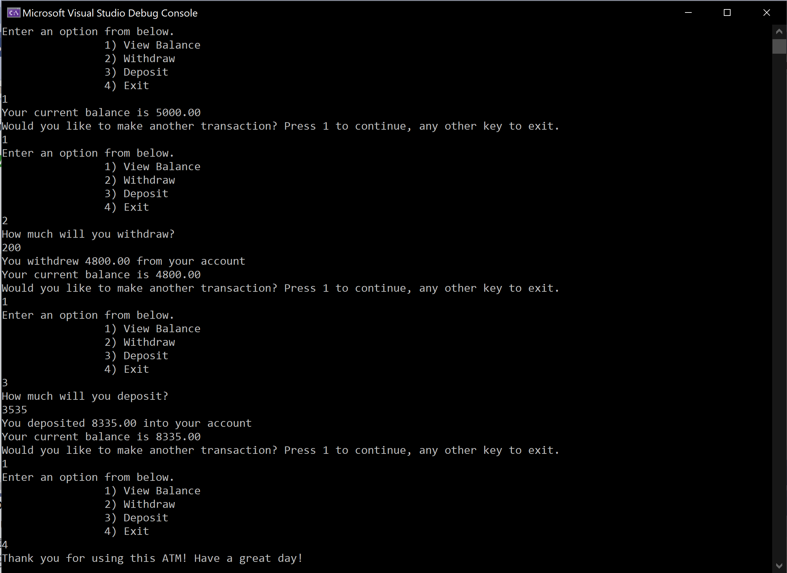

# Lab02-UnitTestDocumentation
Code Fellows 401: Lab 02.

## Introduction

Lab02 - Unit Tests

Authors: Bade Habib

----

## Description
This is a C# console application to practically apply concepts of unit tests. This is done by simulating an ATM interface where the user can withdraw, deposit, and view balance.

---

### Getting Started
Clone this repository to your local machine.

```
$ git clone [x]
```

### To run the program from Visual Studio:
Select ```File``` -> ```Open``` -> ```Project/Solution```

Next navigate to the location you cloned the Repository.

Navigate to the ```Lab02-UnitTestsDocumentation/UnitTestsDocumentation/``` directory.

Then select and open ```UnitTestsDocumentation.sln```

---
### Visuals
#### Example: View Balance, Withdraw, Deposit, & Exit


---
### Change Log
- Initial commit
- Added menu display and view balance
- Added unit tests
- Added Withdraw and Deposit methods

